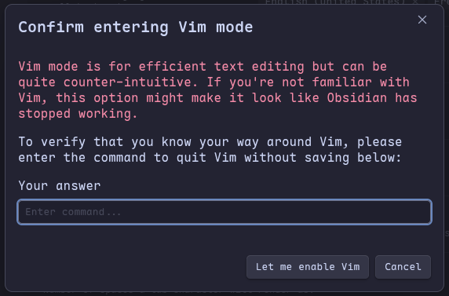

# Vim Motions Workshop

> You already **min-max** in your games because it’s satisfying to master a system.
>
> Why not do the same for how you **navigate and edit text**?
>
> This isn't the "memorize 200 shortcuts" crash course.
>
> It's about ten **semantic moves** - verbs and nouns that you can **combine** like words in English.
>
> In about twelve minutes, you'll get why people won't shut up about Vim.

---

Welcome to the **follow-along repo** for the Vim Motions Workshop!

Each folder is _a level_.

Open the `README.md` on GitLab to read the instructions, then open the practice files in Neovim alongside it.

---

## How to Use This Workshop

**TL;DR: Just do the quests.** Each level has quests, that's all you need to do.

The rest of the text explains the *why* behind each concept. It's there if you want to learn more, but feel free to skip straight to the quests and learn by doing.

---

## Levels

| Folder                           | Topic               | Key Moves                                        |
| -------------------------------- | ------------------- | ------------------------------------------------ |
| [01-modes/](01-modes/)           | Modes & basics      | `i` `a` `o`, `Esc`, `:w`, `u`                    |
| [02-navigation/](02-navigation/) | Navigation & search | `w` `b`, `f` `;`, `gg` `G`, `/` `*`, multipliers |
| [03-combos/](03-combos/)         | Verb + noun combos  | `ci"` `ci(`, `yiw` `p`, `3dd`, `.`               |

---

## Emergency Exit

If you ever feel trapped, here’s the universal escape hatch:

```
Esc
:q!
```

Press `Esc` to return to **Normal mode** (sometimes a few times).

Type `:q!` to **force quit without saving**.

Everyone needs this at least once - usually in the first 5 minutes.

It’s such a rite of passage that Obsidian makes you type `:q!` just to enable Vim key bindings:



---

## Let's Get Started

1. Clone the repo and open the first level:

```bash
git clone https://gitlab.com/talonlikeaclaw/vim-workshop.git
cd vim-workshop/01-modes/
```

2. **[Click here to start the first level](01-modes/)**

---

_Workshop content made with help from [Claude Code](https://claude.ai/code)._
